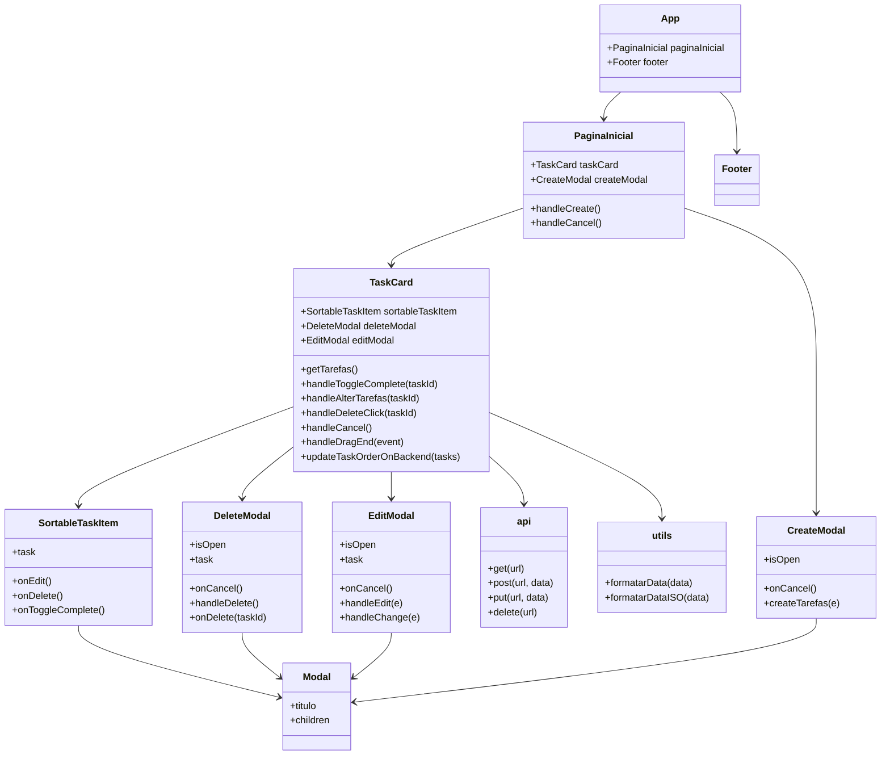

# Lista de Tarefas Frontend

<a id="readme-top"></a>
Este é um projeto frontend utilizando Vite, Tailwind CSS, Yarn, JavaScript SWC e Axios.
Frontend de uma lista de tarefas, onde é possível visualizar, criar, atualizar e deletar tarefas, além de interação drag-and-drop utilizando a lib [dnd-kit](https://dndkit.com). Faz integração com o [Backend Lista Tarefas](https://github.com/Vinicius-Caua/backend-listatarefas)

## Requisitos

- Node.js 20.16.0 ou superior
- Yarn 1.22.22 ou superior

## Configuração do Ambiente

Crie um arquivo `.env` na raiz do projeto e adicione as seguintes variáveis de ambiente:

```env
VITE_API_URL=http://localhost:porta
```
No caso deste projeto, utilizei o [Netfly](https://www.netlify.com) para deploy da aplicação.
## Construção e Execução

Para iniciar o servidor de desenvolvimento, execute o seguinte comando:

```bash
yarn dev
```

Para construir o projeto para produção, utilize o comando:

```bash
yarn build
```

Para visualizar a versão de produção localmente, utilize o comando:

```bash
yarn serve
```

## Endpoints

A aplicação consome os seguintes endpoints da API:

- `GET /tarefas` - Lista todas as tarefas
- `POST /tarefas` - Cria uma nova tarefa
- `PUT /tarefas/{id}` - Atualiza uma tarefa pelo ID
- `DELETE /tarefas/{id}` - Remove uma tarefa pelo ID
## Diagrama de Classes



## Contribuição

Contribuições são bem-vindas! Sinta-se à vontade para abrir uma issue ou enviar um pull request.

## Ferramentas Utilizadas

- `Vite`
- `Tailwind CSS`
- `Yarn`
- `JavaScript SWC`
- `Axios`
- `Visual Studio Code`
- `Netfly`

<p align="right">(<a href="#readme-top">Voltar ao Início</a>)</p>
